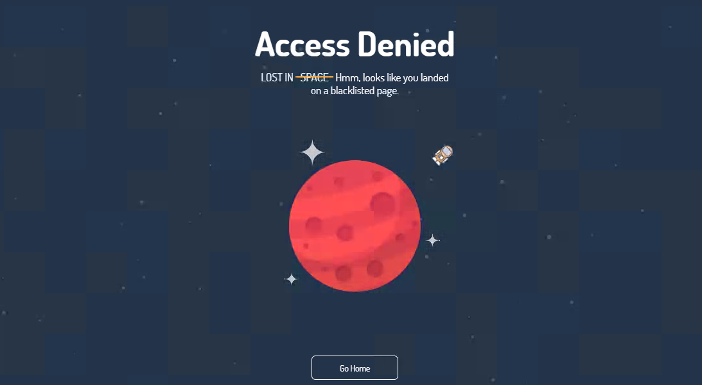

# DockerNginxAccessDenied

## About
This is a simple docker image of 6.78MB which is used to return an access denied as you can see below

The purpose of this project is educational only, the goal is to :
 - Maintain an Nginx webserver
 - Secure an Nginx webserver
 - Gain experience with Docker
 - Perform some research on how a website is loaded by a browser
 - Map security measures to OWASP Top 10 Project

## Updates
 - 20 December 2018 : Enabled "CORS" security feature. 
 - 19 December 2018 : Enabled "gzip module". 

## Security measures
 - Docker/Dockerfile :
   - Base image "alpine:3.8" has been used in order to have a minimalist base image.
   - Official repository have being used for the base image and the nginx package.
   - Only one service has been installed.
   - No volume has been initialized.
  
 - Image :
   - Nginx is running as user **www** which means that once the socket will be open, Nginx will run as **www**.

 - Nginx : 
   - **"server_tokens"** variable has been set to **off** in order to display its current version on error pages. (1)
   - Return a 403 response if the user agent string is in the black list defined in **blockuseragents.rules**
   - Disable unwanted HTTP Methods (different than GET, HEAD and POST)
   - Set buffer size limitations 
   - Added **X-Content-Type-Options=nosniff** header to prevents the browser from doing MIME-type sniffing. (2) 
   - Added **X-XSS-Protection: 1; mode=block** header that stops pages from loading when they detect an XSS attack. (3)
   - Added **X-Frame-Options SAMEORIGIN** header which only allows the current site to frame the content. (4)
   - Added **CORS** headers which determine whether or not it is safe to allow the cross-origin request. (5)
 
(1) It's always better to hide the version of the service which are running as an attacker can use this information in order use a specific vulnerability matching our service with this specific version.  
(2) MIME sniffing was, and still is, a technique used by some web browsers (primarily Internet Explorer) to examine the content of a particular asset. An attacker can leverage MIME sniffing to send an XSS attack.  
(3) The "block mode" will prevent the browser from rendering of the page if an attack is detected rather than sanitizing the page.  
(4) The X-Frame-Options HTTP response header can be used to indicate whether or not a browser should be allowed to render a page in a <frame> or <iframe>. Sites can use this to avoid Clickjacking attacks, by ensuring that their content is not embedded into other sites.  (5) The CORS specification mandates that for non simple requests, such as requests other than GET or POST or requests that uses credentials, a pre-flight OPTIONS request must be sent in advance to check if the type of request will have a bad impact on the data. The pre-flight request checks the methods, headers allowed by the server, and if credentials are permitted, based on the result of the OPTIONS request, the browser decides whether the request is allowed or not.

## To Do 
 - Add Signed certificated by Let's Encrypt
 - Add HTTP2 support

## Mention
Thanks to : 

 - @[hellochad](https://codepen.io/hellochad/) for his [Lost in Space Error Page](https://codepen.io/hellochad/pen/weMpgE)
 - @[digitalocean](https://github.com/digitalocean/) for their tutorial : [How To Add the gzip Module to Nginx on Ubuntu 14.04](https://www.digitalocean.com/community/tutorials/how-to-add-the-gzip-module-to-nginx-on-ubuntu-14-04)
